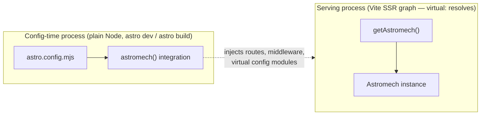
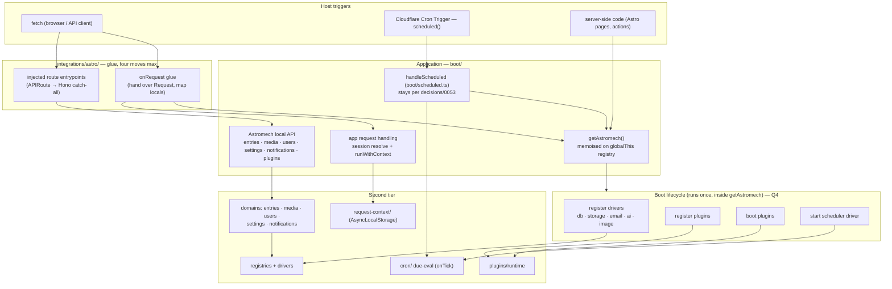
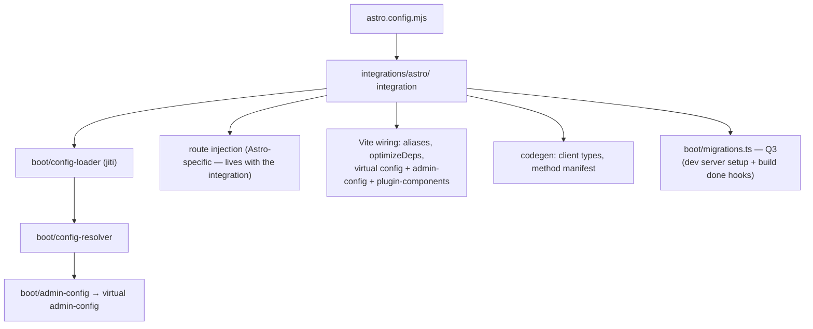
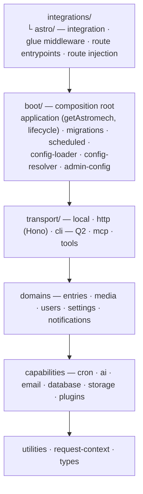

# Application architecture map (in-flight)

The visual companion to `decisions/0057` (proposed) and
`roadmap/planned/application-instance-and-integrations.md`. Target state, not
current state; the "what moves" table at the end maps one onto the other. Open
questions are marked `Q1`–`Q5` and listed at the bottom. Delete this file when
the reorganization ships.

## The two processes

Astromech always runs as two processes with different capabilities. Every
placement decision falls out of this split, so it comes first:

The config-time process cannot resolve `virtual:astromech/config`; the serving
process is the only one that boots. The integration is the bridge, and its
output (injected routes, the virtual modules) is how the serving process later
finds the config.

## Serving process — request flow (target)

Reading it: every host trigger converges on `getAstromech()` — the one front
door — instead of the four self-booting call sites of the current state. The
integration layer touches nothing below the application line.

## Config-time process — integration flow (target)

`config-loader`, `config-resolver`, `admin-config` and `migrations` are
framework-agnostic and stay in `boot/`; the integration calls them. Route
injection and Vite wiring are Astro vocabulary and move with the integration.

## Layer map (target directories)

Arrows are "may import"; nothing imports upward (`lint:deps` enforces it).

## What moves

| Today                                 | Target                                       |
| ------------------------------------- | -------------------------------------------- |
| `boot/astro.ts`                       | `integrations/astro/` (integration)          |
| `src/middleware.ts` (boots + session) | glue in `integrations/astro/` + app handler  |
| `routes/*.ts`                         | `integrations/astro/` (route entrypoints)    |
| `boot/route-registration.ts`          | `integrations/astro/`                        |
| `boot/ensure-booted.ts`               | subsumed by `getAstromech()`                 |
| `boot/boot.ts` (`initRuntime` etc.)   | application lifecycle + `boot/migrations.ts` |
| `boot/scheduled.ts`                   | stays; calls `getAstromech()`                |
| `runScheduledJobs` (deprecated)       | deleted                                      |

## Field research findings

Seven systems researched (Laravel, Payload, Better Auth, Hono, Apostrophe,
Ghost, Directus, Strapi). What recurs, and what to avoid:

- **Every mature system boots as an explicit, ordered, named phase list.**
  Laravel's six bootstrappers, Apostrophe's `modulesRegistered` → schemas →
  migrate → `ready` → `run`, Ghost's numbered steps 0–7, Strapi's `register` →
  `bootstrap` → `listen`. None uses one opaque function. Caution from
  Apostrophe: renamed phases kept legacy aliases (`afterInit`/`modulesReady`)
  and now teach both forever — pick names once.
- **Two-phase plugin registration (register-all, then boot-all) is universal**
  (Laravel providers, Apostrophe define/instantiate, Strapi
  register/bootstrap). Our `registerPlugins`/`bootPlugins` already matches.
- **Migrations on serving boot is the standalone-CMS pattern and the
  embedded-CMS trap.** Apostrophe and Ghost migrate every startup; Apostrophe
  makes it safe (per-migration record + distributed lock + fresh-install marks
  all as run), Ghost doesn't (N replicas race the migration table). Strapi
  adds auto schema-sync on boot with no manual CLI. Directus is the model for
  an embedded CMS: migrate only by explicit command, and at serve start only
  `validateMigrations()` — warn on drift, never mutate.
- **A constructed object must not arm timers.** Directus starts its core
  schedules inside `createApp()`, so importing the app starts `setInterval`s —
  bad for tests and any inspecting process. Ghost starts background services
  in a deliberately un-awaited step 7, after serving. Strapi's cron has no
  leader election, so every replica runs every job.
- **An embedded core exposes a handler and throws typed errors.** All three
  standalone CMSs bind their own port and two exit the process on a bad
  precondition (`process.exit` in Directus, `stopWithError` in Strapi). An
  embedded core can do neither: request handler not server, typed errors the
  integration renders, no `process.exit`.
- **One entry, two terminal modes.** Apostrophe's CLI is `node app <task>` —
  the same entry and full bootstrap as serving, with a single `run(isTask)`
  event deciding listen-or-exit. Ghost's separate `ghost-cli` package is the
  heavier alternative.
- **Declare, then bind.** Apostrophe modules declare routes as data; a central
  `compileRoutes` phase binds them to Express once. That is the shape that
  keeps integrations thin as they multiply: core describes its HTTP surface,
  each integration binds it. Our Hono catch-all approximates this today.
- **Explicit instance beats both a global and no object.** Strapi's
  `global.strapi` forbids two instances per process and makes test isolation
  manual; Ghost's no-object design hand-threads `{ghostServer, config}`
  through every init function. An explicit instance handed to integrations
  (Payload's shape, ours) gets the ergonomics without the coupling — with the
  caveat that our memo must still live on `globalThis` for the tsup
  multi-chunk reason (a mechanism, not an API: nothing reads
  `globalThis.astromech`, everything calls `getAstromech()`).

## Naming flags (raised during review)

- **"wire" is out.** It collides with wire-as-protocol ("wire format", 0013's
  "crosses the wire"). Diagram label is now "register drivers"; code renames:
  `wireEntryAccess`/`wireNotifyAccess` → `setX`, matching the registry setters
  around them (`setDb`, `setStorageDriver`).
- **`register`/`boot` stays as the plugin two-phase pair.** It is the
  established convention (Laravel providers `register()`/`boot()`, Strapi
  `register`/`bootstrap`) and the split is semantic: register declares and
  binds only; boot may use anything registered. "Initialize" names neither
  phase. Decided once, here.
- **"resolve" is earned by config, on probation elsewhere.** Vite's own API is
  `resolveConfig()` → `ResolvedConfig`, so ours stays. `resolveSessionUser`
  has no such prior art (Better Auth says `getSession`) — rename candidate.
  Audit rule: outside config resolution, "resolve" must beat a plainer verb.

## Answered questions

- **Q1 — Config-time application object?** No. The config-time process can
  never boot (no `virtual:`), so an app object there would be a lie — an
  application that cannot start. It stays plain functions
  (`loadConfigFile` → `resolveConfig`), which is also Laravel's shape: the
  builder is not the app.
- **Q2 — CLI through `getAstromech()`?** Yes. Apostrophe's one-entry /
  two-terminal-modes is the model; a CLI with its own boot path is a second
  front door, which is the disease 0057 exists to cure. The `cliConfig` shim
  stays as environment (how plain Node reaches the config), documented as
  such.
- **Q3 — Where may migrations run?** Explicit command only (`db:init`, the
  build/dev hooks), plus a boot-time drift check that warns and never mutates
  (Directus's `validateMigrations` shape). Serving-boot auto-migrate is
  rejected-for-now with the recipe recorded (Apostrophe's record + lock +
  fresh-install-marks-all-run; the lock is a D1 conditional insert on
  Workers), so revisiting it starts from the kit, not from scratch.
- **Q4 — Lifecycle shape?** An ordered named step list with per-step timing.
  Every researched system uses one; the sole recorded regret anywhere is
  renaming phases later, so the names are chosen once, from the ecosystem's
  vocabulary: **register drivers → register plugins → boot plugins → ready →
  start scheduler**. No aliases, ever.
- **Q6 — Disposal?** Deferred, recorded as a known gap in the roadmap file.
  Every mature system grew a `destroy()`; ours arrives when a consumer (test
  isolation, HMR rebuild) actually needs it, designed then against the
  registries that exist then.

- **Q5 — Factory and integration names?** Both keep their names. The app is
  `Astromech`, its factory `getAstromech()` (the `getX` factory shape:
  `getPayload`, `getContext`). The Astro integration factory stays
  `astromech()` because that is Astro's own convention — an integration
  exports a function named for the package (`sitemap()`, `react()`,
  `tailwind()`). They live in different layers, different processes, and
  different subpaths.
- **Q7 — The application is primary; the mirror is dropped.** The app —
  named `Astromech`, it is the core entity — owns the services, the resolved
  config and the lifecycle, with full trusted shapes. There is no shared
  `AstromechClient` contract implemented by two transports: the fetch client
  becomes a standalone typed REST wrapper (`astromechClient`, 0015), typed by
  what the wire actually returns (public shapes), owning fetch-only members
  like `configure`. The evidence that the mirror was wrong: local's `configure`
  no-op (a method implemented only to satisfy a name — the losing-battle
  tell), and the contract claiming identical return types where the transports
  genuinely differ (local: full rows; wire: public projection). Wire-surface
  parity stays a goal, enforced by mechanism rather than by type: the HTTP
  surface derives from the same services (method manifest → dispatch), and
  where a guarantee matters it is a parity test (0056's precedent), not a
  shared interface. Plugins receive the `ctx` accessor surface, never the
  app — nothing hands a plugin `destroy()`.

## Round 2 (all folded into 0057)

- **Config enters at boot.** The ambient `virtual:astromech/config` import
  (~35 module-scope sites) is the underlying disease; config is supplied once
  at boot and read via the app's accessor thereafter (cron's
  `setRuntimeConfig` generalised). Root-barrel `getAstromech` becomes honest
  rather than a lazy-import workaround.
- **Factory, not class** — decided on merits (`this`-binding; nominal
  identity fails across our multiple module registries), not convention.
- **"Local" dropped from the vocabulary** — no mirror, no local/remote pair;
  `astromech/local` retires, root barrel exports `getAstromech`.

## Entry-layer audit (round 3)

Twelve findings, verified against source. Dispositions:

**Dissolved by the plan as it stands:** the CLI's virtual-config shim (a
throwing `rawConfig` Proxy, a `set` trap that mutates live config — dies with
config-at-boot); `getRuntimeConfig` misfiled in `cron/registry.ts` (it is the
seed of the app's config accessor; `users/auth.ts` already reads it);
`transport/local`'s module-scope `setPluginClient`/`setPluginMethods` (moves
into the boot lifecycle, making the package's `"sideEffects": false` claim
true again — the plugin-runtime ↔ local import cycle they dodge gets an
explicit port instead of an import order).

**Settled by one right answer, added to the plan:**

- **A failed boot is retryable.** `ensure-booted.ts` memoises a rejected
  promise forever; `cloudflare/bindings.ts` already clears its slot on
  failure and Payload does the same. The factory clears the memo on
  rejection.
- **Every serving entry goes through `getAstromech()`** — including the three
  route entrypoints, which today rely on `addMiddleware({ order: 'pre' })`
  having run first (an ordering contract enforced by nothing). The memo makes
  the extra call free.
- **Boot is full and singular; entries differ only at the end.** Today four
  callers hand-assemble different boot subsets (middleware: full; MCP: copies
  the order in a comment and skips `bootPlugins`; `index:rebuild`:
  `registerPlugins` only; other CLI commands: config+db only), and
  `boot/plugin-sources.ts` exists to catch the resulting failure. Laravel and
  Apostrophe both answer this the same way: one full bootstrap always, with
  the terminal action (listen / exit) the only difference. Scheduler start
  leaves the boot phases and becomes the serving entry's action — the CLI and
  MCP boot fully and simply never start it. `assertPluginSourcesReachable`
  and the MCP's hand-copy become deletable. (Verify at implementation that
  `bootPlugins` side effects are acceptable in short-lived processes.)
- **Migration failure fails loud.** `runMigrations` swallows everything; the
  comment justifies swallowing only the provider _load_. Narrow the catch;
  a failed `migrateToLatest` stops the dev server / build.
- **Scheduler default comes from config/integration, not a user-agent sniff.**
  `defaultScheduler()` probes `navigator.userAgent === 'Cloudflare-Workers'`;
  the integration knows its platform and supplies the default. The sniff
  stays only for Cloudflare binding resolution, where no config can answer.
- **The manifest generator returns the structure, not a string.** Boot does
  `JSON.parse(generateMethodManifest(...))` — a serialize/parse round trip;
  serialization moves to the two edges that write files. One failure policy.
- **Registry slots split into instance state vs process-global.** Instance:
  db, storage, email, ai, image, scheduler, plugin runtime, manifest, config
  (typed fields — a typo stops creating a silent new slot). Process-global,
  staying on `globalThis`: the ALS request context, cron interval/tick
  guards, `cloudflareEnv`, `uiInstance`, the boot memo itself.
- **`ui-instance-guard` stays** (cheap, caught a real failure); the Vite
  alias table it detects symptoms of moves into `integrations/astro/` with
  the rest of the glue.

**Open (discuss):**

- **Q8 — dev `exports` conditions: `types` at `dist`, `default` at `src`** for
  six subpaths — the stale-dist phantom-error trap by construction (bit us
  this session), invisible to `check:exports`, which compares key sets, not
  conditions. `types` can only point at `src` if the export shims stop using
  `@/` imports (plugin tsconfigs clear `paths`); candidate fix: relative
  imports in `src/exports/*` shims, then `types` → `src`, trap gone.
- **Q9 — module-scope `let` singletons vs the registry premise.**
  `users/auth.ts` holds `let _auth` at module scope — exactly what
  `utilities/registry.ts` says duplicates per tsup chunk. Either a latent
  double-instantiation bug or the premise is overstated for SSR-graph-only
  modules; needs one investigated answer at implementation, then a stated
  rule.

## `boot/` file-by-file (round 4)

Eleven files, 66KB. Verdicts beyond what the plan already moves:

| File                         | Verdict                                             |
| ---------------------------- | --------------------------------------------------- |
| `boot.ts`                    | dissolves → application + `migrations.ts` (planned) |
| `ensure-booted.ts`           | subsumed by `getAstromech()` (planned)              |
| `astro.ts`                   | → `integrations/astro/` (planned)                   |
| `route-registration.ts`      | → `integrations/astro/` (planned)                   |
| `scheduled.ts`               | → `integrations/cloudflare/` (new)                  |
| `relationship-index.ts`      | → `transport/cli/` (beside its only caller)         |
| `validate-stored-content.ts` | → `transport/cli/` (beside its only caller)         |
| `plugin-sources.ts`          | → `transport/cli/`; deletable once boot is one      |
|                              | sequence (audit finding 1)                          |
| `config-loader.ts`           | → `src/config/load.ts`                              |
| `config-resolver.ts`         | → `src/config/` split into named steps              |
| `admin-config.ts`            | → `src/config/admin-config.ts`                      |

Two findings the rest of the plan does not touch:

1. **A stale comment, not a rule, held the maintenance passes in `boot/`.**
   `relationship-index.ts`'s header says boot owns them because they compose
   three domains "which no domain may do";`.dependency-cruiser.cjs` says the
   opposite — domains are peers and may read one another, because forbidding
   it "only pushed the same work somewhere worse". The rule relaxed, the
   files did not move, and the comment kept the placement looking
   deliberate. They go to `transport/cli/`, beside their only callers, which
   needs no new directory and no rule change. Worth generalising: a comment
   that cites a constraint should be checked against the enforced
   constraint, because a stale one reads exactly like a live one.
2. **`config-resolver.ts` is five jobs in one file** (plugin validation,
   entry-type resolution, field-tree structural rules, admin-page resolution,
   public-settings derivation) at 16KB. It is the reason `src/config/`
   earns its own directory rather than a flat move: the split into named
   step files is what makes the "Step 1…Step 5" narration unnecessary.

On the rule regime itself: it did not force any of this, and it has caught
real defects (0053's upward edges; the browser-boundary rules that keep
`virtual:astromech/config` out of the admin bundle). The one thing to watch
is its exemption list — `NO_UPWARD_EXEMPT` for `cli`/`tools`/`mcp`, plus four
hand-written no-upward carve-outs. Exceptions accumulating is the signal that
a rule has started describing the code instead of shaping it; that is the
trigger to revisit, not a general preference for fewer rules.

Next step: commit the doc set, then the implementation branch. Delete this
spec when the work ships.
