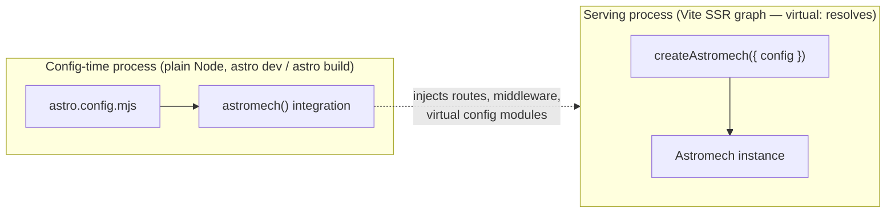

# Application architecture map (in-flight)

The design companion to `decisions/0057-one-application-instance-thin-framework-integrations.md`
and `roadmap/in-progress/application-instance-and-integrations.md`. Target state,
not current state. The roadmap file holds the work and its order; this file
holds the shape, the signatures and the field research behind them.

Delete this file when the reorganization ships.

**This file supersedes parts of 0057 and of the roadmap.** Where they disagree,
this file wins and the supersession is listed under "What changed after 0057"
below, with the reason. 0057 is a decision record and stays as written; a
follow-up record captures the changes when this work lands.

## The two processes

Astromech always runs as two processes with different capabilities. Every
placement decision falls out of this split, so it comes first:



The config-time process cannot resolve `virtual:astromech/config`; the serving
process is the only one that boots. The integration is the bridge, and its
output (injected routes, the virtual modules) is how the serving process later
finds the config.

## The application surface

```ts
// boot/application.ts

export type Astromech = {
    config: ResolvedConfig;

    entries: TypedEntriesService;
    media: MediaService;
    users: UsersService;
    settings: SettingsService;
    notifications: NotificationsService;
    plugins: PluginServiceNamespace;

    /** Terminal HTTP handler. Every Astromech URL, no rewriting by the caller. */
    fetch(request: Request): Promise<Response>;

    /** Run the cron jobs due at `at`. Defaults to now. */
    scheduled(at?: Date): Promise<void>;

    /** Establish the request scope around `run`. Called by integrations, not by site code. */
    withRequest<T>(request: Request, run: () => Promise<T>): Promise<T>;

    /** The acting user for the current request scope, resolved on first ask. */
    getCurrentUser(): Promise<User | null>;
    getCurrentRole(): Promise<Role | null>;

    /** The serving integration's terminal action. Idempotent. No-op on Workers. */
    startScheduler(): Promise<void>;
};
```

No `destroy()`. Recorded as a known gap in the roadmap; it arrives when a
consumer needs it, designed then against the registries that exist then.

### Creation and access

```ts
// boot/application.ts

/**
 * Initialise. Fills the globalThis slot SYNCHRONOUSLY with its own in-flight
 * promise before the first await, so a concurrent second caller always sees a
 * filled slot and no window exists in which two boots start.
 *
 * Idempotent: a second call with the same config object returns the existing
 * instance. A second call with a DIFFERENT config throws. A failed boot clears
 * the slot so the next caller retries.
 */
export function createAstromech(options: { config: AstromechConfig }): Promise<Astromech>;

/** Accessor. No arguments, never creates. Throws when the slot is empty. */
export function getAstromech(): Promise<Astromech>;
```

Why the split, and why `create` is the forgiving one: Laravel is the model
(`bootstrap/app.php` creates, `app()` only ever reads), but Laravel gets one
entry per **process**, so "already created" cannot arise. A Cloudflare Worker
exports `fetch` and `scheduled` from one module sharing one isolate, and either
can be first. That asymmetry is why `create` must be idempotent here and is not
in Laravel. It is an environment fact, so a comment may state it.

`getAstromech()` does **not** self-boot. Two functions that both initialise
would be two front doors, which is the disease 0057 exists to cure.

### Where Laravel was deliberately not followed

Laravel splits a cheap synchronous `create()` from an expensive
`bootstrapWith()` guarded by `hasBeenBootstrapped()`, triggered by the kernel
inside `handleRequest`/`handleCommand`. That is safe because the kernel is a
single chokepoint every path goes through.

We have no equivalent. `app.fetch()` and `app.scheduled()` would be chokepoints,
but `app.entries.find()` called from an Astro page is not. Without one, deferring
boot means every accessor needs a "booted yet?" branch. So `createAstromech` is
one async function that does everything.

### Boot phases

Ordered, named, timed. Names chosen once, no aliases ever (Apostrophe's legacy
aliases are the cautionary tale).

```
resolve config  →  register drivers  →  register plugins  →  boot plugins  →  ready
```

`register`/`boot` for the plugin pair is the established two-phase convention
(Laravel providers, Strapi register/bootstrap) and the split is semantic:
register declares and binds only; boot may use anything registered.

**Scheduler start is not a phase.** Laravel never owns a timer: `schedule:run`
is external cron invoking the CLI. Our `interval()` driver exists only because a
Node deployment has no external cron, which makes starting it a deployment
decision. It becomes `app.startScheduler()`, called by the integration that
knows its platform. The CLI and MCP boot fully and never call it.

## Target directory tree

```
src/
├── integrations/          NEW — framework and runtime glue (entrypoints layer)
│   ├── astro/
│   │   ├── index.ts               astromech(): AstroIntegration
│   │   ├── vite.ts                alias table, optimizeDeps, define, virtual modules
│   │   ├── virtual-module.ts      virtualModule(name, load) helper
│   │   ├── routes.ts              injectRoute calls
│   │   ├── middleware.ts          onRequest — six lines, one job
│   │   └── handler.ts             the injected route entrypoint (one line)
│   └── cloudflare/
│       └── index.ts               createWorkerEntry(astroEntry)
├── config/                NEW — the config pipeline (capabilities layer)
│   ├── index.ts
│   ├── load.ts                    jiti loading
│   ├── resolve.ts                 orchestration only
│   ├── entry-types.ts             toResolvedEntryType, toResolvedFields, collectSearchable
│   ├── admin-pages.ts             resolveAdminPage, resolvePageFields
│   ├── plugin-entries.ts          plugin identity validation + namespaced entry types
│   ├── public-settings.ts         the inline derivation block
│   ├── admin-config.ts            buildAdminConfig, toAdminEntryType
│   ├── registry.ts                setConfig / getConfig
│   └── validate/
│       ├── field-tree.ts          validateFieldTree, assertUnique*
│       ├── relationships.ts       assertQualifiedRelationshipTargets
│       └── media-access.ts        assertMediaAccessCompatible
├── boot/                  NARROWED — composition root only
│   ├── application.ts             createAstromech, getAstromech, the Astromech type
│   ├── lifecycle.ts               the ordered phases with per-step timing
│   └── migrations.ts              runMigrations, checkMigrationDrift
├── transport/
│   ├── http/                      Hono, now BUILT AT BOOT
│   ├── cli/                       + relationship-index, validate-stored-content
│   ├── mcp/
│   └── tools/
└── (domains, capabilities, leaves unchanged)
```

Deleted directories: `src/routes/` (into `integrations/astro/`),
`src/transport/local/` (dissolves into the instance).

### Layer table

`.dependency-cruiser.cjs` `LAYERS` becomes:

```js
const LAYERS = [
    ['integrations', 'admin', 'boot', 'codegen'], // was: routes, admin, boot, codegen
    ['transport', 'policies'],
    ['entries', 'media', 'users', 'settings', 'notifications'],
    [
        'config',
        'database',
        'storage',
        'email',
        'ai',
        'cron', // config ADDED here
        'cloudflare',
        'request-context',
        'fields',
        'permissions',
        'plugins/runtime',
    ],
    ['types', 'utilities', 'errors'],
];
```

**`config/` goes in the capabilities layer, not above the domains.** The roadmap
says above; that is wrong and this supersedes it. Two reasons:

1. Config readers are not only domains. `cron/runner.ts`, `request-context/` and
   `users/auth.ts` all need it and all sit below the domains. Anything placed
   above the domains fails for them, which is exactly why `cron/registry.ts`
   grew `getRuntimeConfig` as a private workaround.
2. The pipeline has no real dependency on the domains. Its six domain imports
   are constants and pure `.shared` helpers, not behaviour. Moving them down
   removes the inversion without an exemption.

The symbols that had to move down before `config/` could sit at layer 3.
Settled in stage 1 by reading each module: none carries a real domain
dependency (every one imports from `@/types/` only), so the placement of
`config/` holds. Two entries came out wider than first proposed.

| Symbol                                                                            | Was                                         | Now                               |
| --------------------------------------------------------------------------------- | ------------------------------------------- | --------------------------------- |
| `QUALIFIED_SEPARATOR`, `parseEntryTypeId`, `qualifyEntryType`, `resolveEntryType` | `entries/type-ids.shared.ts`                | `utilities/entry-type-ids.ts`     |
| `Capability`, `BUILT_IN_SUPPORTS`                                                 | `entries/storage/capabilities.ts`           | `utilities/entry-capabilities.ts` |
| `resolveEntryCapabilities`, `assertEntryTypeValid`                                | `entries/storage/capabilities.ts`           | `config/entry-types.ts`           |
| `CLOUDFLARE_IMAGES_DRIVER`                                                        | `media/serving/image/drivers/cloudflare.ts` | `utilities/image-drivers.ts`      |
| `normaliseWidths`, `defaultImageWidths`                                           | `url.shared.ts`, `defaults.ts`              | `utilities/image-widths.ts`       |

The two widenings: `type-ids.shared.ts` moved whole rather than two of its four
symbols, since the same callers use the rest; and `capabilities.ts` split rather
than surrendering one constant, because the resolver imported
`resolveEntryCapabilities`, `assertEntryTypeValid` and the `Capability` type
from it as well. Those two functions have exactly one caller, so they are
resolution steps and landed in `config/`. Files in `utilities/` drop the
`.shared` marker: the directory is already browser-safe by `BROWSER_SAFE`.

`src/config.d.ts` became `src/virtual-modules.d.ts`. It holds only ambient
`declare module` blocks, but at its old path it shadowed the new `src/config/`
directory in module resolution.

## Config enters at boot

```ts
// config/registry.ts — the same shape as database/registry.ts
export const setConfig: (config: ResolvedConfig) => void;
export const getConfig: () => ResolvedConfig; // throws when unset
```

`config/` produces the resolved config, boot supplies it to the registry slot,
every reader takes it from there at **call time**. This generalises the
miniature that already exists as `cron/registry.ts`'s
`setRuntimeConfig`/`getRuntimeConfig`, and it is Laravel's shape too:
`LoadConfiguration` is a bootstrap step and everything afterwards reads
`config()`.

~30 module-scope `import config from 'virtual:astromech/config'` sites migrate to
`getConfig()`. When it lands, the only `virtual:` importers left are the entry
files that **supply** config.

**The role map is computed once during resolution** and held on `ResolvedConfig`.
Today `resolveRole` calls `resolveRoles(config)`, which rebuilds the entire map
on every call; that expense is the only reason the request context carries a
resolved `Role` alongside the user. Fix the derivation and the duplication goes
away on its own. The fail-open fallback in the same function is filed separately
as `roadmap/planned/role-resolution-fails-open.md` and is **not** in scope here.

## Request identity

```ts
// request-context/request-context.ts
export type RequestContext = {
    request: Request;
    user?: User | null; // filled on first resolve, reused for the rest of the request
};

export function runWithRequest<T>(request: Request, fn: () => Promise<T>): Promise<T>;
export function getCurrentUser(): Promise<User | null>; // was sync
export function getCurrentRole(): Promise<Role | null>; // was sync
```

The store holds the **request**, not resolved identity. Identity derives from it
on first ask and caches for that request.

What this buys, beyond correctness:

- A request that never asks who the user is costs **zero** database queries.
  Today the middleware resolves eagerly on every request: two round trips
  (Better Auth's `getSession`, then the full user row). Media serving reads no
  identity at all, so a page with twenty images currently does forty queries
  nobody reads.
- **Four independent session resolvers collapse to one.** The Astro middleware,
  Hono's `requireAuth`, Hono's `optionalAuth` and the cron poke route each call
  `resolveSessionUser` today, each with its own "has someone already done this?"
  branch. Those branches get deleted, not relocated.

Cost: 21 call sites across 18 files become `await`. All are already inside async
functions and TypeScript flags every one.

**Nothing is written to `Astro.locals`, and `src/env.d.ts` stops declaring
`App.Locals`.** The current declaration merges `user` and `session` into Astro's
global `App.Locals` interface, so a host site declaring its own `user` gets a
TypeScript conflict and a broken build. Nothing in the repo reads either field.
A host page reaches identity through the app:

```astro
---
const app = await getAstromech();
const user = await app.getCurrentUser();
const posts = await app.entries.find('post'); // runs as that user
---
```

If Astro-idiomatic sugar is ever wanted, it gets one namespaced key we own
(`Astro.locals.astromech`), which is Clerk's shape. On evidence, not in
anticipation.

**Draft visibility is a query concern, not an identity one.**
`entries/operations/query.ts` already has `VisibilityShape`, `applyVisibility`
and `markPublic`. Whatever default a host page should get is decided at that
seam. Do not solve it by blanking the user.

## HTTP surface

**The Hono app is built during boot, not at module scope.** This is the fix that
matters: `transport/http/index.ts` currently does `export const app = new
OpenAPIHono()` at import time, before any config exists. That is why its routes
are registered at bare paths and why `routes/api.ts` performs URL surgery to
strip the base, and why every middleware inside it reads `Astromech.config`
lazily from within the handler.

Built at boot, routes register at their **real absolute paths** from the resolved
config. No `basePath`, no rewriting, and the two-prefix case falls out for free.

```ts
// transport/http/index.ts
export function createHttpApp(config: ResolvedConfig): OpenAPIHono<AppEnv>;
```

Mounted inside it:

- The API surface at `${basePath}/api/*`.
- **Better Auth, catch-all**: `app.on(['GET','POST'], `${basePath}/api/auth/*`, (c) => auth.handler(c.req.raw))`.
  This deletes the current requirement that the auth route be injected *before\*
  the API catch-all, an ordering contract nothing enforces.
- **Media** at `${mediaRoute}/*`, so `app.fetch` really is one terminal handler
  and media inherits access control and headers.

Astro injects two patterns, both pointing at the same one-line entrypoint:

```ts
// integrations/astro/handler.ts — the whole file
export const prerender = false;
export const ALL: APIRoute = async ({ request }) => (await getAstromech()).fetch(request);
```

### Routes and `basePath`

```ts
basePath: '/cms'; // admin UI at `${basePath}`, API at `${basePath}/api`
mediaRoute: '/_media'; // unchanged
```

`basePath` replaces `adminRoute` and `apiRoute`, which become derived. `basePath`
is the established key name (Hono, Better Auth, Next.js). This is a breaking
config change; `apps/demo` and `apps/docs` move with it.

Two reasons it is worth doing here rather than later:

- `apiRoute` currently defaults to `/api`, which squats on a path plenty of Astro
  sites want for their own endpoints.
- One prefix collapses three injected route patterns toward one for the operator
  surface.

**Media keeps its own top-level prefix**, and the deciding argument is
operational rather than conceptual. A WAF rule, CDN cache bypass, `robots.txt`
disallow or IP allowlist on `/cms/*` to protect the admin is an ordinary thing
to deploy; if media lived under that prefix, every one of them would break every
image on the public site. Admin and API are session-bound and never cached;
media is long-cached, public, and ends up in third-party caches and other
people's links. One prefix cannot carry both policies. CMS ownership is
satisfied by owning the handler, which `app.fetch` does.

**The underscore convention resolves the naming split.** `_astro/`, `/_next/`,
`/_nuxt/` all mark "framework-owned machine path". That is for paths a machine
fetches, not paths a human types. So `/_media` keeps its underscore and `/cms`
stays plain, because the admin is the one Astromech path people bookmark.

## Integrations

An integration makes four moves: capture the input in the host's native form,
get the app, hand it over, emit the result. An integration needing a new branch
in core is reporting a missing application capability.

```ts
// integrations/astro/middleware.ts — the whole file
import config from 'virtual:astromech/config';
import { createAstromech } from '@/boot/application';

export const onRequest: MiddlewareHandler = async (context, next) => {
    const app = await createAstromech({ config });
    await app.startScheduler();
    return app.withRequest(context.request, () => next());
};
```

```ts
// integrations/cloudflare/index.ts
export function createWorkerEntry(astro: {
    fetch: ExportedHandlerFetchHandler;
}): ExportedHandler;
```

```js
// the site's src/worker.ts — one file, both handlers
import astro from './dist/_worker.js';
import { createWorkerEntry } from 'astromech/cloudflare';
export default createWorkerEntry(astro);
```

This is `public/index.php` for the edge, and it removes the hand-written
`scheduled()` boilerplate the current setup asks of site authors.

`defaultScheduler()` stops sniffing `navigator.userAgent`. The integration knows
its platform and supplies the default. The sniff stays only for Cloudflare
binding resolution, where no config can answer.

## Published surface

`astromech/local` retires. `getAstromech` and `createAstromech` ship from the
root barrel, which the config-at-boot rule makes honest: core modules no longer
carry graph-bound imports, and `check:node-imports` proves it.

The `AstromechClient` shared contract is deleted. `astromechClient` becomes a
standalone typed REST wrapper, typed by what the wire actually returns (public
projections), owning `configure({ baseUrl })`. The local no-op implementation of
`configure` dies with it: a method implemented only to satisfy a name means the
contract is fighting the implementation and losing.

Wire-surface parity stays the goal, enforced by mechanism rather than interface
(method manifest → dispatch), with a parity test where a specific guarantee
matters, as `decisions/0056-better-auth-owns-the-users-format-not-its-ddl.md` did.

Two moves in the `exports` map, with the published specifiers unchanged:

| Specifier               | Was                         | Becomes                                    |
| ----------------------- | --------------------------- | ------------------------------------------ |
| `astromech/astro`       | `dist/boot/astro.js`        | `dist/integrations/astro/index.js`         |
| `astromech/middleware`  | `src/exports/middleware.ts` | `integrations/astro/middleware.ts`         |
| `astromech/routes/*.ts` | `src/routes/*.ts`           | `integrations/astro/handler.ts` (one file) |
| `astromech/local`       | `src/exports/local.ts`      | **retired**                                |
| `astromech/cloudflare`  | `dist/cloudflare/index.js`  | gains `createWorkerEntry`                  |

**`dist/boot/config-resolver.js` is a landmine.** The generated
`virtual:astromech/config` module writes an absolute path to it, computed
relative to the integration's own `import.meta.url`. Moving both the integration
and the resolver changes that relative path, and the tsup entry key with it. Two
places, and `check:boot` is the only thing that catches a mismatch.

## What moves

| Today                                                    | Target                                                             |
| -------------------------------------------------------- | ------------------------------------------------------------------ |
| `boot/astro.ts`                                          | `integrations/astro/` (split: index, vite, routes)                 |
| `src/middleware.ts`                                      | `integrations/astro/middleware.ts`                                 |
| `src/routes/*.ts` (three files)                          | `integrations/astro/handler.ts` (one)                              |
| `boot/route-registration.ts`                             | `integrations/astro/routes.ts`                                     |
| `boot/scheduled.ts`                                      | `integrations/cloudflare/index.ts`                                 |
| `boot/ensure-booted.ts`                                  | subsumed by `createAstromech`                                      |
| `boot/boot.ts`                                           | `boot/application.ts` + `boot/lifecycle.ts` + `boot/migrations.ts` |
| `boot/config-loader.ts`                                  | `config/load.ts`                                                   |
| `boot/config-resolver.ts`                                | `config/` split into named steps                                   |
| `boot/admin-config.ts`                                   | `config/admin-config.ts`                                           |
| `boot/relationship-index.ts`                             | `transport/cli/`                                                   |
| `boot/validate-stored-content.ts`                        | `transport/cli/`                                                   |
| `boot/plugin-sources.ts`                                 | deleted (boot is one sequence; the guard has nothing to catch)     |
| `transport/local/index.ts`                               | dissolves into the instance                                        |
| `transport/astromech-client.shared.ts`                   | deleted                                                            |
| `transport/cli/virtual-config-shim.ts`                   | deleted                                                            |
| `runScheduledJobs` (deprecated)                          | deleted                                                            |
| `cron/registry.ts` `setRuntimeConfig`/`getRuntimeConfig` | `config/registry.ts`                                               |

## Renames

| From                 | To                | Why                                                                                                                             |
| -------------------- | ----------------- | ------------------------------------------------------------------------------------------------------------------------------- |
| `wireEntryAccess`    | `setEntryAccess`  | matches the registry setters beside it; "wire" means the transport here (`decisions/0013-chat-transcript-as-content-blocks.md`) |
| `wireNotifyAccess`   | `setNotifyAccess` | same                                                                                                                            |
| `resolveSessionUser` | `getSession`      | Better Auth's vocabulary                                                                                                        |
| `handleScheduled`    | `app.scheduled`   | pairs with `app.fetch`; Cloudflare's own handler name, not a coinage                                                            |
| `cfg`                | `entryType`       | the `code` skill bans the abbreviation                                                                                          |
| `pkgSrc`, `mod`      | spelled out       | same                                                                                                                            |

`resolveConfig` / `ResolvedConfig` stay: Vite's own API. Outside config
resolution, "resolve" must beat a plainer verb.

## What changed after 0057

0057 stays as written. These supersede it, and a follow-up decision record
captures them when the work lands.

| 0057 / roadmap said                                             | Now                                                                                          | Why                                                                                                                                       |
| --------------------------------------------------------------- | -------------------------------------------------------------------------------------------- | ----------------------------------------------------------------------------------------------------------------------------------------- |
| `getAstromech()` is the memoised factory and the one front door | `createAstromech({ config })` initialises; `getAstromech()` only reads and throws when empty | an argument honoured only on the first call is a trap; Laravel separates the two and so do we                                             |
| `config/` sits above the domains                                | `config/` sits in the capabilities layer                                                     | readers below the domains (`cron`, `request-context`, `users/auth`) exist, and the pipeline's domain imports are constants, not behaviour |
| the CLI keeps the `virtual:` shim as environment (Q2)           | the shim is deleted; the CLI calls `createAstromech({ config })`                             | the two statements contradicted; supplying config is what makes the shim unnecessary                                                      |
| middleware boots the runtime and populates `locals`             | middleware establishes the request scope only                                                | nothing reads `locals`, and declaring `App.Locals` breaks a host that declares its own `user`                                             |
| session resolved eagerly per request                            | resolved lazily on first ask                                                                 | media and static requests read no identity and should pay nothing                                                                         |
| `adminRoute` + `apiRoute`                                       | one `basePath`                                                                               | `/api` squats on a path sites want; one operator prefix collapses the injected patterns                                                   |
| `app.fetch` unspecified; three injected route files             | one terminal handler, Hono built at boot at absolute paths                                   | the URL surgery in `routes/api.ts` is a symptom of the Hono app being constructed before its config exists                                |

## Constraints that must survive

- The instance slot lives on `globalThis` (tsup emits multiple entry chunks; a
  module-scoped memo duplicates per chunk and boots twice).
- Request-scoped state never lives on the instance. `request-context/`
  (AsyncLocalStorage) carries it. Workers isolates, Node processes and dev HMR
  all reuse one instance across many requests; Laravel needed Octane's
  clone-per-request sandbox to retrofit this and we avoid needing it.
- Construction must not arm behaviour: no timers, no I/O on import. Directus
  starts schedules inside `createApp()`, so importing its app starts timers.
- The core exposes a request handler, not a server. Precondition failures throw
  typed errors the integration renders; never `process.exit`.
- The per-domain registries stay underneath the instance. This is a front door
  and a lifecycle, not a dependency-injection rework.
- Two processes, not one. The config-time process cannot resolve `virtual:` and
  gets no application object; an app that can never start would be a lie.
- Migrations run by explicit command only (`db:init`, the build/dev hooks), plus
  a boot-time drift check that warns and never mutates (Directus's shape; Ghost's
  migrate-on-every-boot is the counter-example).

## Decide during implementation

- **Virtual config module identity across chunks.** `createAstromech`'s
  "different config throws" guard compares object identity. The virtual module
  is externalised so the host's Vite should resolve it once, but this codebase
  has been bitten by chunk duplication before. Verify in stage 2; if identity is
  not reliable, the guard reuses silently instead and the reason is recorded.
- **Q8 — the `exports` dev-condition trap.** Six subpaths resolve `types` from
  `dist` and `default` from `src`, so a source edit is live while its types are
  whatever the last build emitted. `check:exports` compares key sets, not
  conditions. Agreed fix pending feasibility: give the `src/exports/*` shims
  relative imports instead of `@/`, then point `types` at `src` too. Plugin
  tsconfigs clear `paths`, which is why the `@/` imports fail there.
- **Q9 — module-scope `let` singletons. Answered.** ESM splitting put the one
  `betterAuth(` call in a shared chunk, so the served build held a single copy
  and there was no live bug — safe by build configuration, not by design. The
  second tsup build and the Q8 dev-condition trap both reach the same module, so
  `let _auth` and its `Proxy` are now an optional registry slot behind
  `getAuth()`, and module-scope singletons are ruled out in `ARCHITECTURE.md`.
- **Default visibility shape for host pages.** Decided at the `VisibilityShape`
  seam, not by touching identity. Out of scope here; raise it as its own item if
  the answer is not obvious when the lazy-identity stage lands.
- **`bootPlugins` in short-lived processes.** Boot is now full and singular, so
  the CLI and MCP run `bootPlugins` where they previously skipped it. Verify the
  side effects are acceptable.

## Known gaps, deferred by decision

- **No `destroy()` / teardown.** Every mature system grew one (Apostrophe's
  `apos.destroy()`, Strapi's `destroy()`); ours arrives when a real consumer
  needs it (test isolation, an HMR rebuild), designed then against the
  registries that exist then.
- **`.dependency-cruiser.cjs` stays.** It did not force any of this and it has
  caught real defects (0053's upward edges; the browser-boundary rules that keep
  the config virtual module out of the admin bundle). The signal to watch is its
  exemption list growing, because accumulating exceptions mean a rule has begun
  describing the code instead of shaping it.

## Field research

Eight systems (Laravel, Payload, Better Auth, Hono, Apostrophe, Ghost, Directus,
Strapi). What recurs, and what to avoid:

- **Every mature system boots as an explicit, ordered, named phase list.**
  Laravel's six bootstrappers, Apostrophe's `modulesRegistered` → schemas →
  migrate → `ready` → `run`, Ghost's numbered steps 0–7, Strapi's `register` →
  `bootstrap` → `listen`. None uses one opaque function. Caution from
  Apostrophe: renamed phases kept legacy aliases and now teach both forever.
- **Laravel's entry files create; its accessor never does.** `public/index.php`
  and `artisan` both require `bootstrap/app.php`, which returns a created
  application. `app()` resolves `Container::getInstance()` and returns whatever
  that created. Ambient access, explicit creation.
- **Laravel's cron is not a separate entry.** System cron runs
  `php artisan schedule:run` every minute: an ordinary console command through
  the ordinary CLI entry. `ScheduleRunCommand` snapshots `Date::now()` once into
  `startedAt` and evaluates every due event against that one value, which is the
  same reason Cloudflare passes `scheduledTime` rather than letting the handler
  read the clock.
- **Two-phase plugin registration (register-all, then boot-all) is universal**
  (Laravel providers, Apostrophe define/instantiate, Strapi register/bootstrap).
- **Migrations on serving boot is the standalone-CMS pattern and the
  embedded-CMS trap.** Apostrophe makes it safe (per-migration record +
  distributed lock + fresh-install marks all run); Ghost doesn't (N replicas
  race the migration table). Directus is the model for an embedded CMS:
  migrate by explicit command, validate on serve start.
- **A constructed object must not arm timers.** Directus starts its core
  schedules inside `createApp()`. Strapi's cron has no leader election, so every
  replica runs every job.
- **An embedded core exposes a handler and throws typed errors.** All three
  standalone CMSs bind their own port and two exit the process on a bad
  precondition (`process.exit` in Directus, `stopWithError` in Strapi).
- **Declare, then bind.** Apostrophe modules declare routes as data; a central
  `compileRoutes` phase binds them to Express once. That is the shape that keeps
  integrations thin as they multiply.
- **Explicit instance beats both a global and no object.** Strapi's
  `global.strapi` forbids two instances per process; Ghost's no-object design
  hand-threads `{ghostServer, config}` through every init function.
